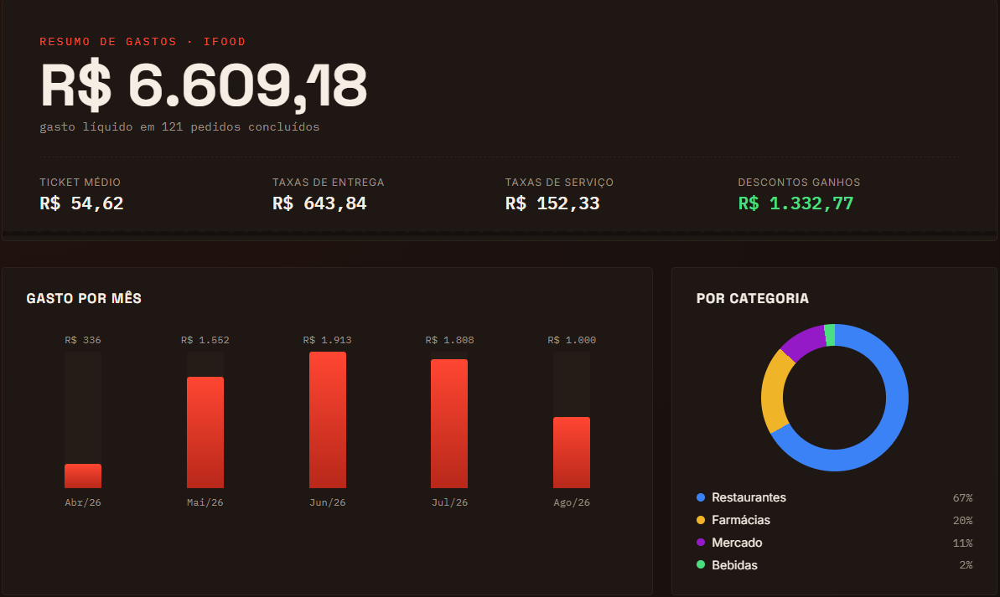

#  iFood Radar

> Informações sobre o seu histórico no iFood que o app não te mostra.



---

### O que o dashboard exibe

| Métrica | Descrição |
|---|---|
| **Total gasto** | Valor líquido real (já descontando reembolsos) |
| **Ticket médio** | Valor médio por pedido concluído |
| **Taxas de entrega** | Quanto você pagou só de frete no total |
| **Taxas de serviço** | Taxas adicionais cobradas pelo iFood |
| **Descontos ganhos** | Total economizado em promoções e cupons |
| **Gasto por mês** | Gráfico de barras mês a mês |
| **Por categoria** | Restaurantes, Farmácias, Mercado, Bebidas, Pet... |
| **Top estabelecimentos** | Onde você mais gastou, com ranking e contagem de pedidos |
| **Métodos de pagamento** | Quanto foi no cartão, Pix, iFood Card etc. |
| **Top entregadores** | Entregadores que te atenderam mais de uma vez |
| **Reembolsos** | Lista de pedidos com estorno |
| **Pedido mais caro** | O pedido campeão, com todos os itens detalhados |
| **Todos os pedidos** | Tabela completa com data, estabelecimento e valor |

---

## Requisitos

- Python 3.8+
- Google Chrome

---

## Instalação

```bash
pip install -r requirements.txt
```

---

## Como usar

```bash
python radar_ifood.py
```

1. O Chrome será aberto para login
2. O script detecta sua sessão e captura o token automaticamente
3. Aguarde a listagem de todos os pedidos
4. O relatório **`ifood_dashboard.html`** será gerado na pasta do projeto

> **Nota:** O Chrome salva o perfil em `chrome_profile_ifood/` na pasta do script. Nas próximas execuções você provavelmente já estará logado e não precisará fazer login de novo.

---

## Como funciona

```
radar_ifood.py
├── Abre Chrome (nodriver)
├── Navega para ifood.com.br/pedidos
├── Intercepta a requisição de rede e captura o Bearer Token
├── Usa o token para chamar a API do iFood diretamente
│   └── GET /site-api/v4/customers/me/orders?page=N&size=100
├── Lista todas as páginas até não haver mais pedidos
├── Analisa os dados:
│   ├── Filtra apenas pedidos CONCLUDED
│   ├── Calcula valores líquidos (descontando reembolsos)
│   └── Agrupa por mês, categoria, estabelecimento e método de pagamento
├── Salva ifood_pedidos.json
└── Gera ifood_dashboard.html
```

---

> O relatório considera apenas pedidos concluídos — pedidos cancelados pelo estabelecimento, não pagos ou reembolsados totalmente não são contabilizados.